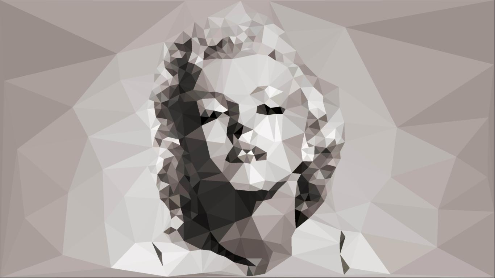
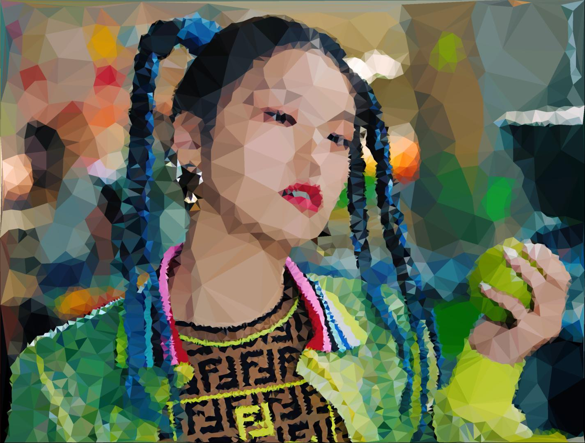
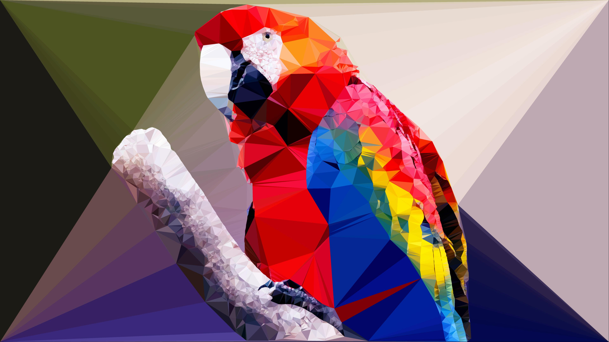

[](https://www.python.org/downloads/)
[](https://github.com/psf/black)
[](https://opensource.org/licenses/MIT)
[](https://github.com/tdh8316/triangler/stargazers)
[](https://twitter.com/intent/tweet?text=Convert%20images%20to%20Low-Poly%20art:&url=https%3A%2F%2Fgithub.com%2Ftdh8316%2Ftriangler)

# Overview
`Triangler` is a tool to generate Low-Polygon image using [Delaunay triangulation](https://en.wikipedia.org/wiki/Delaunay_triangulation).


# Usage
Currently, the interface for end-users is only Command-Line.
```cmd
$ git clone https://github.com/tdh8316/triangler.git
$ python -m pip install -r requirements.txt
$ python triangler-cli.py
```
## Setup
```cmd
$ git clone https://github.com/tdh8316/triangler.git
$ python -m pip install setup.py
$ python -m triangler -h
usage: __main__.py [-h] [-o OUTPUT [OUTPUT ...]] [-s {POISSON_DISK,THRESHOLD}]
                   [-e {CANNY,ENTROPY,SOBEL}] [-b BLUR] [-c {MEAN,CENTROID}]
                   [-p POINTS] [-v]
                   images [images ...]

positional arguments:
  images                Source files

optional arguments:
  -h, --help            show this help message and exit
  -o OUTPUT [OUTPUT ...], --output OUTPUT [OUTPUT ...]
                        Destination file (default: None)
  -s {POISSON_DISK,THRESHOLD}, --sample {POISSON_DISK,THRESHOLD}
                        Sampling method for candidate points. (default: THRESHOLD)
  -e {CANNY,ENTROPY,SOBEL}, --edge {CANNY,ENTROPY,SOBEL}
                        Pre-processing method to use. (default: SOBEL)
  -b BLUR, --blur BLUR  Blur radius for approximate canny edge detector.
                        (default: 2)
  -c {MEAN,CENTROID}, --color {MEAN,CENTROID}
                        Coloring method for rendering. (default: CENTROID)
  -p POINTS, --points POINTS
                        Points threshold. (default: 1024)
  -v, --verbose         Set logger level as DEBUG (default: False)
```

The `POISSON_DISK` option is extremely slow, however it can provide the best result.

It takes a minimum of 5 seconds to a maximum of 3 minutes.

## Example command
`$ python -m triangler image.jpg -o output.jpg -s poisson_disk`

# Sample
|Original|5000 Points|
|:------:|:---------:|
||
|**2500 Points**|**1000 Points**|
|||

|Original|Processed|
|--------|---------|
|||
|||
|||
|||

# License
Licensed under the **MIT** License.
